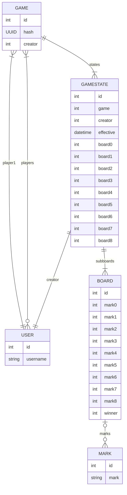

# Mike Check
It's ultimate tic tac toe, but... 😆 player 1 is 🎤 and player 2 is ✅

## Data Model

**NOTE: DJANGO ALREADY INCLUDES A USER MODEL THAT HAS A USERNAME, SO I WILL USE THAT RATHER THAN MAKING MY OWN CLASS.**



### Data Model Example
1. player creates a game
```js
const game = {
    "id": 1,
    "hash": "ax2byc",
    "creator": 1
}
let gameState = {
    "id": 1,
    "creator": 1,
    "effective": "2025-02-18T00:00:00.000Z",
    "board0": 1,
    "board1": 2,
    "board2": 3,
    "board3": 4,
    "board4": 5,
    "board5": 6,
    "board6": 7,
    "board7": 8,
}

let subboards = [
    {
        "id": 1,
        "mark0": 1,
        "mark1": 2,
        "mark2": 3,
        "mark3": 4,
        "mark4": 5,
        "mark5": 6,
        "mark6": 7,
        "mark7": 8,
        "mark8": 9
    },
    {
        "id": 2,
        "mark0": 1,
        "mark1": 2,
        "mark2": 3,
        "mark3": 4,
        "mark4": 5,
        "mark5": 6,
        "mark6": 7,
        "mark7": 8,
        "mark8": 9
    },
    {
        "id": 3,
        "mark0": 1,
        "mark1": 2,
        "mark2": 3,
        "mark3": 4,
        "mark4": 5,
        "mark5": 6,
        "mark6": 7,
        "mark7": 8,
        "mark8": 9
    },
    {
        "id": 4,
        "mark0": 1,
        "mark1": 2,
        "mark2": 3,
        "mark3": 4,
        "mark4": 5,
        "mark5": 6,
        "mark6": 7,
        "mark7": 8,
        "mark8": 9
    },
    {
        "id": 5,
        "mark0": 1,
        "mark1": 2,
        "mark2": 3,
        "mark3": 4,
        "mark4": 5,
        "mark5": 6,
        "mark6": 7,
        "mark7": 8,
        "mark8": 9
    },
    {
        "id": 6,
        "mark0": 1,
        "mark1": 2,
        "mark2": 3,
        "mark3": 4,
        "mark4": 5,
        "mark5": 6,
        "mark6": 7,
        "mark7": 8,
        "mark8": 9
    },
    {
        "id": 7,
        "mark0": 1,
        "mark1": 2,
        "mark2": 3,
        "mark3": 4,
        "mark4": 5,
        "mark5": 6,
        "mark6": 7,
        "mark7": 8,
        "mark8": 9
    },
    {
        "id": 8,
        "mark0": 1,
        "mark1": 2,
        "mark2": 3,
        "mark3": 4,
        "mark4": 5,
        "mark5": 6,
        "mark6": 7,
        "mark7": 8,
        "mark8": 9
    }
]    
    
const gameMarks = [
    {
        "id": 1,
        "mark": ""
    },
    {
        "id": 2,
        "mark": ""
    },
    {
        "id": 3,
        "mark": ""
    },
    {
        "id": 4,
        "mark": ""
    },
    {
        "id": 5,
        "mark": ""
    },
    {
        "id": 6,
        "mark": ""
    },
    {
        "id": 7,
        "mark": ""
    },
    {
        "id": 8,
        "mark": ""
    },
    {
        "id": 9,
        "mark": ""
    }
]
```
